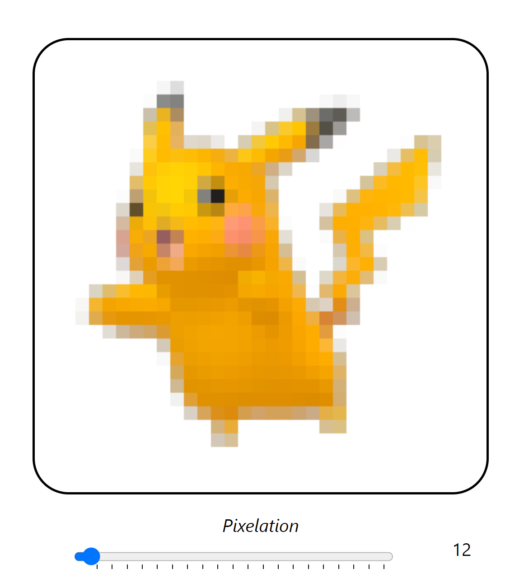

# 2023-07-02

* client
    * create routes for random Pokemon and random Pokemon by generation
    * implement simple pixelation algorithm for pixelating sprites
* server
    * create endpoint for getting sprites via proxy
    * create endpoint for getting random Pokemon spcies

# 2023-07-10

* server
    * create game registry to manage games
    * setup websockets for duplex connection