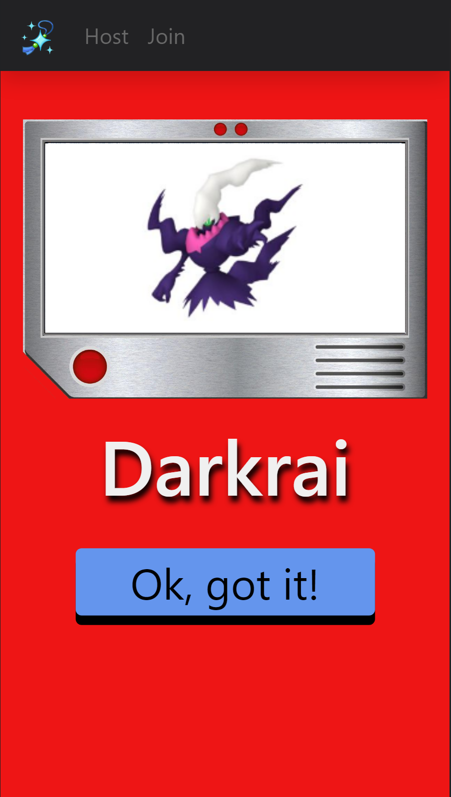

# 2023-07-02

* client
    * create routes for random Pokemon and random Pokemon by generation
    * implement simple pixelation algorithm for pixelating sprites
* server
    * create endpoint for getting sprites via proxy
    * create endpoint for getting random Pokemon spcies

# 2023-07-10

* server
    * create game registry to manage games
    * setup websockets server

# 2023-07-11

* server
    * implement hosting and joining games
    * implement starting and cancelling games

# 2023-07-12

* server
    * designed JSON-based communications protocol

# 2023-07-13 - 2023-07-14

* server
    * overhauled protocol to exclusivly use JSON for all communications
    * create Round class to asynchronously run rounds
    * create Picker class to randomly select Pokemon

# 2023-07-15

* server
    * implement ready method in Round to synchronize players
    * add base64 encoded URLs to QUESTION packets

# 2023-07-16

* server
    * add scoring system and leaderboard
    * add better error messages

# 2023-07-17

* client
    * create websocket controller for recieving messages from client
    * create simple UI to host, join, and leave games
* server
    * change specs of HOSTED, JOINED, and LEFT packets to include all players
    * add logging for new and closed connections

# 2023-07-19

* client
    * create root, host, join, lobby, and game routes
    * organize data flow and navigation between pages
* server
    * changed STARTED packets to be delievered before each round
    * improved logging by adding server uptime

# 2023-07-20

* client
    * design phase system to direct between pages
    * finish prototype on layout for game

# 2023-07-23

* client
    * finalize designs for home, host, join, and lobby pages
    * add navigation bar for all pages

    
    
    
    

# 2023-07-25

* client
    * add pokedex frame to round page
    * overlay canvas on frame and synchronize drawing
    * rework button layout

# 2023-07-26

* client
    * add a countdown before each round
    * add pixelation to images

# 2023-07-28

* client
    * add countdown timer bar
    * add de-pixelation reveal animation

