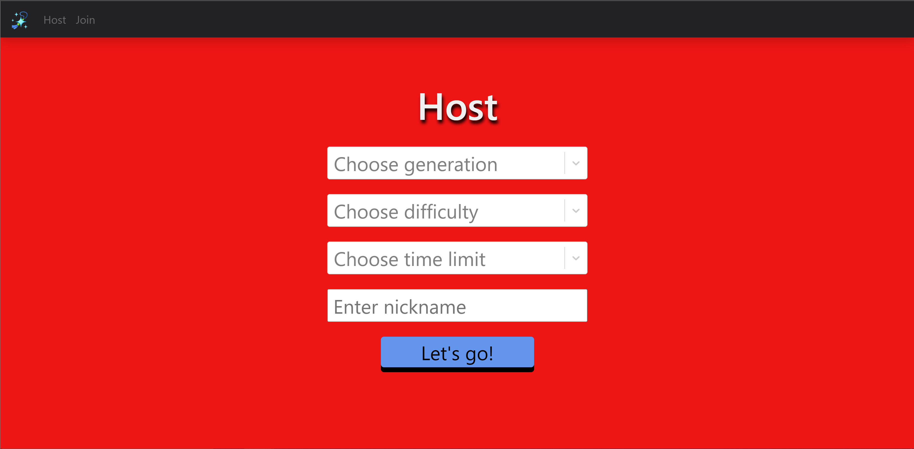

# PokéGuessr: Shiny Edition :sparkles: (https://pokeguessr-q4s3.onrender.com/)

# About

Try to guess Pokémon based on their shiny forms. Play multiplayer against friends for the title of Pokémon master. This project was created to learn about websockets in Node and practice fontend with React. 

<p align="center">
    
</p>

# Features

### Host and Join Games

Easily host and join games for friends by sharing unique ids. 

<div align="center" style="display: flex; justify-content: space-evenly; flex-wrap: wrap">
    
    
</div>
<br/>
<p align="center">
    
</p>

### Realtime Multiplayer

Play realtime multiplayer using bidirectional websockets. 

<p align="center">
    
</p>

### Competitive Leaderboard

Compete with friends for the title of Pokémon master. 

<p align="center">
    
</p>

# Build

This project uses [node](https://nodejs.org/en) for the backend and [react](https://react.dev) for the frontend. If the site is ever down you can run it locally.

1. Clone and cd into directory

```
git clone https://github.com/TahsinAhmed13/poke-guessr.git
cd poke-guessr
```

2. Run the backend

```
cd server
npm start
```

3. Run the frontend

```
cd client
npm start
```

4. Navigate to [https://localhost:8000](https://localhost:8000) on your browser. 

# Techstack

### Server

* [ws](https://github.com/websockets/ws)
* [node-fetch](https://github.com/node-fetch/node-fetch)
* [cheerio](https://cheerio.js.org/docs/intro)

### Client

* [react](https://react.dev/)
* [create-react-app](https://create-react-app.dev/)
* [react-bootstrap](https://react-bootstrap.netlify.app/)
* [react-router](https://reactrouter.com/en/main)

# Credits

The images for shiny Pokémon are scraped from [pokemondb](https://pokemondb.net/pokedex/shiny). [Render](https://render.com/) is used to host both the frontend and backend.  

# Issues

Pokémon forms are not handled properly and don't show up in the choices. As a result, if a certain species has two forms (ie. mega evolution, regional varient) it is possible that both options show up in a round. 